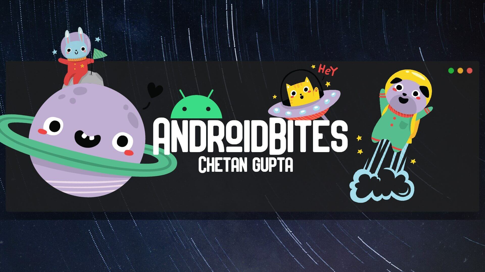

<h1 align="center"><a href="https://chetangupta.net/" target="_blank">AndroidBites</a>
</h1>

## Android Developer Challeneg 2021 [Week 1]

    

Application to participate in [Android Dev Challenege 2021](https://android-developers.googleblog.com/2021/02/android-dev-challenge-lift-off-with.html)

# PupDopter :dog2:
PupDopter :dog2: is Puppy adoption app build with :heart: and :rocket: Jetpack Compose #AndroidDevChallenge

## Preview :movie_camera:

## Built With 🛠
- [Kotlin](https://kotlinlang.org/) official programming language for Android development.
- [Jetpack Compose](https://developer.android.com/jetpack/compose) Android’s modern toolkit for building native UI.
- [Jetpack Compose Navigation](https://developer.android.com/jetpack/compose/navigation) - Navigation between screens of Application

## Build-tool 🧰
You need to have [Android Studio Beta 3 or above](https://developer.android.com/studio/preview) to build this project.
 

 

## :eyes: Social
[LinkedIn](https://bit.ly/ch8n-linkdIn) |
[Medium](https://bit.ly/ch8n-medium-blog) |
[Twitter](https://bit.ly/ch8n-twitter) |
[StackOverflow](https://bit.ly/ch8n-stackOflow) |
[CodeWars](https://bit.ly/ch8n-codewar) |
[Portfolio](https://bit.ly/ch8n-home) |
[Github](https://bit.ly/ch8n-git) |
[Instagram](https://bit.ly/ch8n-insta) |
[Youtube](https://bit.ly/ch8n-youtube)

## :cop: License
Shield: [![CC BY-SA 4.0][cc-by-sa-shield]][cc-by-sa]

This work is licensed under a
[Creative Commons Attribution-ShareAlike 4.0 International License][cc-by-sa].

[![CC BY-SA 4.0][cc-by-sa-image]][cc-by-sa]

[cc-by-sa]: http://creativecommons.org/licenses/by-sa/4.0/
[cc-by-sa-image]: https://licensebuttons.net/l/by-sa/4.0/88x31.png
[cc-by-sa-shield]: https://img.shields.io/badge/License-CC%20BY--SA%204.0-lightgrey.svg
